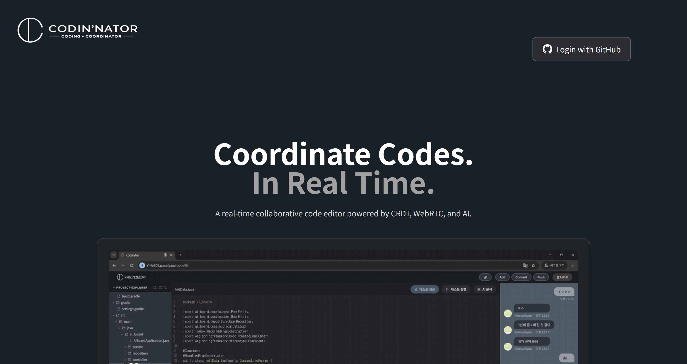
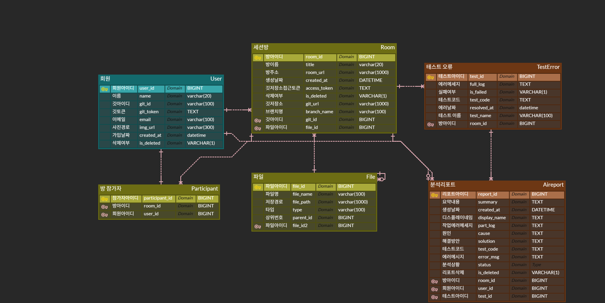

### <center>Codin’nator</center>

팀원과 함께 **실시간으로 코드를 편집**할 수 있는 협업 툴

WebSocket을 활용하여 누구나 쉽게 참여할 수 있는 실시간 코드 작성 협업 플랫폼을 제공합니다.

- **개발 기간:** 2026.01.06 ~ 2026.02.06 **(5주)**
- **플랫폼:** Web & Desktop App
- **개발 인원:** 6명
- **기관:** 삼성 청년 SW·AI 아카데미 14기



### 팀원 구성

| 공윤정
(Backend & Leader) | 문현지
(Frontend & JiraOps) | 김내현
(Frontend & Infra) |

| 이규성
(Frontend & AI) | 김수미
(Frontend) | 장하은
(Backend & Infra) |

### 기술 스택

### Frontend

| Category                | Stack                 |
| ----------------------- | --------------------- |
| Language                | TypeScript            |
| Runtime Environment     | Node.js               |
| Framework               | React 18, Vite        |
| State Management        | Zustand               |
| Styling                 | Tailwind CSS          |
| Code Editor             | Slate.js, Y.js (CRDT) |
| Real-time Communication | SockJS, STOMP         |
| Voice Chat              | WebRTC                |
| Text Chat               | WebSocket             |
| HTTP Client             | Axios                 |
| Routing                 | React Router v6       |
| Package Manager         | npm                   |
| IDE                     | Visual Studio Code    |

### Backend

| Category          | Stack                                               |
| ----------------- | --------------------------------------------------- |
| Language          | Java 17                                             |
| Framework         | Spring Boot 4.0.1, Spring Data JPA, Spring Security |
| Authentication    | OAuth2 Client, JJWT (JSON Web Token)                |
| Database          | MySQL                                               |
| API Documentation | Swagger UI (Springdoc OpenAPI)                      |
| Real-time         | Spring WebSocket                                    |
| Library           | JGit (Git Repository Control), Lombok               |
| IDE               | IntelliJ IDEA 2023.3.8 (Ultimate Edition)           |
| Build Tool        | Gradle 9.2.1                                        |

### AI

| Category            | Stack |
| ------------------- | ----- |
| Language            |       |
| Runtime Environment |       |
| Framework           |       |
| Library             |       |
| IDE                 |       |

### Infra

| Category       | Spec |
| -------------- | ---- |
| Instance Type  |      |
| CPU            |      |
| RAM            |      |
| Storage (Disk) |      |
| Docker         |      |
| Docker Compose |      |
| Jenkins        |      |
| Nginx          |      |

### 프로젝트 구조 (Frontend)

```
frontend/
├── public/                     # 정적 파일
│   └── favicon.ico
├── src/
│   ├── api/                    # API 통신 모듈
│   │   ├── axiosInstance.ts    # Axios 인스턴스 설정
│   │   ├── authApi.ts          # 인증 관련 API
│   │   ├── projectApi.ts       # 프로젝트 관련 API
│   │   └── chatApi.ts          # 채팅 관련 API
│   ├── assets/                 # 이미지, 폰트 등 정적 리소스
│   ├── components/             # 공통 컴포넌트
│   │   ├── common/             # 버튼, 모달 등 범용 컴포넌트
│   │   ├── editor/             # 코드 에디터 관련 컴포넌트
│   │   │   ├── SlateEditor.tsx # Slate 에디터 메인 컴포넌트
│   │   │   ├── Toolbar.tsx     # 에디터 툴바
│   │   │   └── Cursor.tsx      # 다른 사용자 커서 표시
│   │   ├── chat/               # 채팅 관련 컴포넌트
│   │   │   ├── TextChat.tsx    # 텍스트 채팅 (WebSocket)
│   │   │   └── VoiceChat.tsx   # 음성 채팅 (WebRTC)
│   │   ├── fileTree/           # 파일 트리 탐색기
│   │   └── layout/             # 레이아웃 컴포넌트
│   ├── hooks/                  # 커스텀 훅
│   │   ├── useWebSocket.ts     # WebSocket 연결 훅
│   │   ├── useWebRTC.ts        # WebRTC 연결 훅
│   │   └── useYjs.ts           # Y.js 동기화 훅
│   ├── pages/                  # 페이지 컴포넌트
│   │   ├── LoginPage.tsx       # 로그인 페이지
│   │   ├── DashboardPage.tsx   # 대시보드 페이지
│   │   └── EditorPage.tsx      # 에디터 페이지
│   ├── stores/                 # Zustand 상태 관리
│   │   ├── useAuthStore.ts     # 인증 상태
│   │   ├── useEditorStore.ts   # 에디터 상태
│   │   └── useProjectStore.ts  # 프로젝트 상태
│   ├── styles/                 # 글로벌 스타일
│   ├── types/                  # TypeScript 타입 정의
│   ├── utils/                  # 유틸리티 함수
│   ├── App.tsx                 # 앱 루트 컴포넌트
│   ├── main.tsx                # 엔트리 포인트
│   └── vite-env.d.ts           # Vite 환경 타입 선언
├── .env                        # 환경 변수
├── index.html                  # HTML 엔트리
├── package.json
├── tailwind.config.ts          # Tailwind CSS 설정
├── tsconfig.json               # TypeScript 설정
└── vite.config.ts              # Vite 설정
```

### 시스템 아키텍처


### 기능 구성

|     |     |
| --- | --- |
|     |     |
|     |     |

### 프로젝트 산출물

### ERD



### 트러블슈팅 (Frontend)

#### 1. Y.js + Slate 동시 편집 시 커서 위치 이탈 문제

**문제:** 여러 사용자가 동시에 같은 문서를 편집할 때, Y.js의 CRDT 병합 과정에서 Slate 에디터의 커서(Selection)가 엉뚱한 위치로 이동하거나 사라지는 현상이 발생했습니다.

**원인:** Y.js의 원격 변경 사항이 Slate의 로컬 상태에 반영될 때, Slate가 내부적으로 Selection을 재계산하면서 원격 변경분의 오프셋을 반영하지 못했습니다.

**해결:** Y.js의 `observe` 콜백에서 원격 변경 사항을 적용한 뒤, 로컬 사용자의 커서 위치를 Y.js의 `RelativePosition`을 기반으로 복원하는 로직을 추가했습니다. 원격 변경인 경우에만 커서 보정을 수행하도록 `origin` 플래그를 활용하여 로컬/원격 변경을 구분했습니다.

#### 2. WebRTC 음성 채팅 연결 실패 (NAT 환경)

**문제:** 같은 네트워크가 아닌 외부 환경에서 WebRTC 음성 채팅 연결이 실패하는 문제가 발생했습니다.

**원인:** NAT(Network Address Translation) 환경에서 피어 간 직접 연결이 불가능한 경우, ICE Candidate 교환이 완료되지 않아 연결이 수립되지 않았습니다.

**해결:** STUN 서버만 사용하던 설정에서 TURN 서버를 추가로 구성하여, 직접 연결이 불가능한 환경에서도 릴레이를 통해 음성 데이터를 전송할 수 있도록 했습니다. ICE Candidate 수집 완료 타임아웃도 설정하여 연결 지연을 방지했습니다.

#### 3. SockJS + STOMP 재연결 시 메시지 유실

**문제:** 네트워크 불안정으로 WebSocket 연결이 끊어졌다가 재연결될 때, 끊어진 동안의 채팅 메시지가 유실되는 문제가 발생했습니다.

**원인:** STOMP 클라이언트의 기본 재연결 로직은 구독을 복원하지만, 연결이 끊어진 시간 동안 서버에 전송된 메시지를 별도로 요청하지 않았습니다.

**해결:** 재연결 시 마지막으로 수신한 메시지의 타임스탬프를 서버에 전달하고, 해당 시점 이후의 누락된 메시지를 REST API로 조회하여 보충하는 방식을 구현했습니다. 또한 STOMP 클라이언트에 heartbeat 설정을 추가하여 연결 상태를 주기적으로 확인하도록 했습니다.

#### 4. Zustand 상태 업데이트로 인한 불필요한 리렌더링

**문제:** 에디터 페이지에서 Zustand 스토어의 상태가 변경될 때마다 에디터 전체가 리렌더링되어 입력 지연(Input Lag)이 발생했습니다.

**원인:** Zustand 스토어에서 상태를 구독할 때 selector를 사용하지 않고 전체 스토어를 구독하면서, 관련 없는 상태 변경에도 컴포넌트가 리렌더링되었습니다.

**해결:** `useEditorStore` 훅에서 selector 패턴을 활용하여 각 컴포넌트가 필요한 상태만 개별적으로 구독하도록 변경했습니다. 추가로 `React.memo`와 `useCallback`을 적용하여 불필요한 하위 컴포넌트 리렌더링을 방지했습니다.

### 라이선스

이 프로젝트는 **삼성 청년 SW·AI 아카데미(SSAFY) 14기** 교육 과정의 일환으로 제작되었습니다.

본 프로젝트의 소스 코드 및 산출물에 대한 저작권은 팀원 전원과 SSAFY에 귀속되며, 무단 복제 및 배포를 금지합니다.
