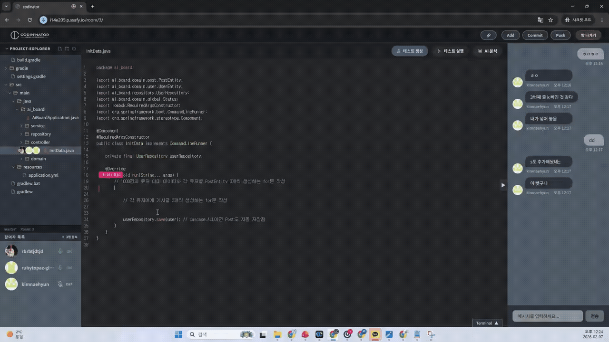

<div align="center">

# Coordin'nator

### 팀원과 함께 실시간으로 동시에 코드를 편집하는 협업 IDE

<br/>



<br/>
<br/>


</div>

<br/>

## 📑 목차

[프로젝트 소개](#-1-프로젝트-소개) &nbsp;·&nbsp; [만든 이유](#-2-coordinnator를-만든-이유) &nbsp;·&nbsp; [팀원 구성](#-3-팀원-구성) &nbsp;·&nbsp; [주요 기능](#-4-주요-기능) &nbsp;·&nbsp; [기술 스택](#️-5-기술-스택) &nbsp;·&nbsp; [시스템 아키텍처](#️-6-시스템-아키텍처) &nbsp;·&nbsp; [프로젝트 구조](#-7-프로젝트-구조) &nbsp;·&nbsp; [ERD](#-8-erd) &nbsp;·&nbsp; [트러블슈팅](#-9-트러블슈팅) &nbsp;·&nbsp; [시작하기](#-10-시작하기)

<br/>

## 💻 1. 프로젝트 소개

> **팀원과 함께 실시간으로 동시에 코드를 편집할 수 있는 협업 툴**

**Coordin'nator**는 Yjs(CRDT)를 기반으로 여러 사용자가 **하나의 코드를 동시에 편집**하고, **음성·텍스트 채팅**으로 소통하며, **AI가 테스트 코드 생성과 에러 분석**까지 도와주는 실시간 협업 코딩 플랫폼입니다. GitHub 연동을 통해 에디터 안에서 직접 커밋과 푸시까지 수행할 수 있습니다.

| 항목 | 상세 내용 |
| --- | --- |
| 🗓️ **개발 기간** | 2026.01.06 ~ 2026.02.06 **(5주)** |
| 💻 **플랫폼** | Web |
| 👥 **개발 인원** | 6명 |
| 🏢 **기관** | 삼성 청년 SW·AI 아카데미 14기 |

<br/>

## 🎯 2. Coordin'nator를 만든 이유

페어 프로그래밍이나 팀 코드 리뷰를 하다 보면 이런 불편함을 자주 겪게 됩니다.

- **소통과 코딩 도구가 따로 놉니다.** 화면 공유는 화상 회의 앱으로, 코드는 IDE로, 대화는 메신저로 — 창을 계속 옮겨 다녀야 합니다.
- **테스트와 디버깅은 여전히 혼자만의 몫입니다.** 에러가 나면 원인을 찾는 데 시간을 쏟게 됩니다.

**Coordin'nator는 이 문제를 해결하기 위해 만들어졌습니다.** 여러 사람이 동시에 같은 코드를 편집하고, 한 화면 안에서 음성·텍스트로 소통하며, AI가 테스트 코드 생성과 에러 분석을 거들어 협업의 마찰을 줄입니다.

<br/>

## 👥 3. 팀원 구성

| 공윤정 | 문현지 | 김내현 |
| :---: | :---: | :---: |
| **Backend & Leader** | **Frontend & JiraOps & Design** | **Frontend & Infra** |

| 이규성 | 김수미 | 장하은 |
| :---: | :---: | :---: |
| **Frontend & AI** | **Frontend** | **Backend & Infra** |

<br/>

## ✨ 4. 주요 기능

| 기능 | 설명 |
| --- | --- |
| **실시간 동시 편집** | Y.js(CRDT) 기반으로 여러 사용자가 동시에 코드를 편집하며, 원격 커서 위치를 실시간으로 표시 |
| **음성 채팅** | WebRTC 기반 P2P 음성 채팅을 지원하며, 개별 사용자 음소거 기능 제공 |
| **텍스트 채팅** | SockJS + STOMP 기반 실시간 메시지 전송 및 재연결 시 메시지 보충 |
| **AI 테스트 코드 생성** | Java 소스 코드를 기반으로 LLM이 테스트 코드를 자동 생성 |
| **AI 에러 분석** | 테스트 실행 결과를 AI가 분석하여 에러 원인과 해결책을 한국어로 제시 |
| **Git 연동** | GitHub OAuth2 인증 후 JGit을 통해 Add, Commit, Push를 에디터 내에서 직접 수행 |
| **오류 잔디** | 참여한 방에서 발생한 오류 빈도를 GitHub 잔디 스타일로 시각화 |
| **프로젝트 파일 관리** | 파일 트리 탐색기를 통한 프로젝트 구조 확인 및 파일 업로드 |

<br/>

## 🛠️ 5. 기술 스택

<div align="center">

### Frontend


<table>
<tr><th>Category</th><th>Stack</th></tr>
<tr><td>Language</td><td>TypeScript 5.9</td></tr>
<tr><td>Framework</td><td>React 19, Vite 7</td></tr>
<tr><td>State Management</td><td>Zustand 5</td></tr>
<tr><td>Styling</td><td>Tailwind CSS 4, Radix UI, framer-motion</td></tr>
<tr><td>Code Editor</td><td>Slate 0.123, @slate-yjs/core, Yjs 13.6 (CRDT)</td></tr>
<tr><td>Terminal</td><td>xterm 5.3</td></tr>
<tr><td>Realtime</td><td>SockJS, STOMP (@stomp/stompjs 7), y-websocket, WebRTC</td></tr>
<tr><td>HTTP Client</td><td>Axios 1.13</td></tr>
<tr><td>Routing</td><td>React Router 7</td></tr>
<tr><td>Package Manager</td><td>npm</td></tr>
</table>

<br/>

### Backend


<table>
<tr><th>Category</th><th>Stack</th></tr>
<tr><td>Language</td><td>Java 17</td></tr>
<tr><td>Framework</td><td>Spring Boot 4.0.1, Spring Data JPA, Spring WebSocket</td></tr>
<tr><td>Security</td><td>Spring Security, OAuth2 Client, JJWT 0.11.5</td></tr>
<tr><td>Database</td><td>MySQL (mysql-connector-j)</td></tr>
<tr><td>API Documentation</td><td>Springdoc OpenAPI (Swagger UI) 2.3.0</td></tr>
<tr><td>Util</td><td>Lombok</td></tr>
<tr><td>Build Tool</td><td>Gradle</td></tr>
</table>

<br/>

### AI


<table>
<tr><th>Category</th><th>Stack</th></tr>
<tr><td>Language</td><td>Python 3.11</td></tr>
<tr><td>Framework</td><td>FastAPI 0.115.8</td></tr>
<tr><td>ASGI Server</td><td>uvicorn 0.34.0</td></tr>
<tr><td>LLM</td><td>OpenAI SDK 1.59.5</td></tr>
<tr><td>Library</td><td>httpx 0.27.2, Pydantic 2.10.6, python-dotenv 1.0.1</td></tr>
</table>

<br/>

### Infra


<table>
<tr><th>Category</th><th>Spec</th></tr>
<tr><td>Instance</td><td>SSAFY EC2 (Ubuntu 22.04)</td></tr>
<tr><td>Container</td><td>Docker Compose v2</td></tr>
<tr><td>CI/CD</td><td>Jenkins</td></tr>
<tr><td>Web Server</td><td>Nginx (with SSL / Let's Encrypt)</td></tr>
</table>

</div>

<br/>

## 🏗️ 6. 시스템 아키텍처

<div align="center">

</div>

<br/>

## 📁 7. 프로젝트 구조

<details>
<summary><b>Frontend</b></summary>

<br/>

```
frontend/
├── src/
│   ├── api/                        # API 통신 모듈
│   │   ├── axios.ts                # Axios 인스턴스 설정
│   │   └── interceptors.ts         # 요청/응답 인터셉터
│   ├── auth/                       # 인증 관련
│   │   └── bootstrapAuth.ts        # 초기 인증 부트스트랩
│   ├── components/
│   │   ├── ai/                     # AI 관련 컴포넌트
│   │   │   └── CodeEditorAi.tsx    # AI 코드 분석 UI
│   │   ├── common/                 # 공통 컴포넌트
│   │   │   ├── Alert.tsx
│   │   │   └── Loading.tsx
│   │   ├── home/                   # 홈 페이지 컴포넌트
│   │   │   ├── create-room/        # 방 생성
│   │   │   ├── error-report/       # 오류 잔디 & 리포트
│   │   │   └── profile/            # 프로필 섹션
│   │   ├── room/                   # 방(에디터) 페이지 컴포넌트
│   │   │   ├── chat/               # 텍스트/음성 채팅
│   │   │   ├── code-editor/        # Slate + Y.js 코드 에디터
│   │   │   ├── file-viewer/        # 파일 트리 탐색기
│   │   │   └── room-terminal/      # 터미널 출력
│   │   └── routes/                 # 라우트 가드
│   ├── hooks/
│   │   ├── room/
│   │   │   ├── chat/               # 채팅 관련 훅 (STOMP, WebRTC)
│   │   │   ├── code-editor/        # 에디터 훅 (커서, 자동완성)
│   │   │   ├── file/               # 파일 관련 훅
│   │   │   └── terminal/           # 터미널 훅
│   │   └── user/                   # 사용자 인증 훅
│   ├── pages/                      # 페이지 컴포넌트
│   │   ├── Home/                   # 마이페이지 (방 목록, 오류 잔디)
│   │   ├── Landing/                # 랜딩 페이지
│   │   ├── Room/                   # 에디터 페이지
│   │   └── NotFound/               # 404 페이지
│   ├── services/                   # API 서비스 레이어
│   │   ├── ai/                     # AI 서비스 호출
│   │   ├── room/                   # 방 관리 서비스
│   │   └── user/                   # GitHub 연동 서비스
│   ├── stores/                     # Zustand 상태 관리
│   │   └── authStore.ts            # 인증 상태
│   ├── types/                      # TypeScript 타입 정의
│   └── utils/                      # 유틸리티 함수
├── index.html
├── package.json
├── tsconfig.json
└── vite.config.ts
```

</details>

<details>
<summary><b>Backend</b></summary>

<br/>

```
backend/
├── src/main/java/com/gt/codinnator/
│   ├── CodinnatorApplication.java      # 메인 애플리케이션
│   ├── config/
│   │   └── CorsConfig.java             # CORS 설정
│   └── domain/
│       ├── ai/                          # AI 테스트 생성 도메인
│       │   ├── controller/              # AiFileController
│       │   ├── entity/                  # AiTestReport
│       │   ├── repository/
│       │   └── service/                 # 테스트 코드 생성 서비스
│       ├── common/
│       │   └── config/                  # WebSocket 공통 설정
│       ├── editor/                      # 코드 에디터 도메인
│       │   ├── config/handler/          # CodeHandler (WebSocket)
│       │   ├── controller/              # Code/File Controller
│       │   ├── dto/
│       │   ├── entity/                  # FileNode
│       │   ├── repository/
│       │   └── service/
│       ├── git/                         # Git 연동 도메인
│       │   ├── controller/              # GitController
│       │   ├── dto/                     # Commit/ChangeFile DTO
│       │   └── service/                 # JGit 기반 Git 서비스
│       ├── room/                        # 방 관리 도메인
│       │   ├── controller/              # Room/Participant Controller
│       │   ├── dto/
│       │   ├── entity/                  # Room, Participant
│       │   ├── repository/
│       │   └── service/
│       ├── run/                         # 코드 실행 도메인
│       │   ├── controller/              # WorkerController
│       │   ├── dto/
│       │   ├── service/                 # Gradle 테스트 러너
│       │   └── utils/
│       ├── textchat/                    # 텍스트 채팅 도메인
│       │   ├── config/                  # WebSocket 설정
│       │   ├── controller/
│       │   ├── dto/
│       │   ├── entity/
│       │   ├── repository/
│       │   └── service/
│       ├── user/                        # 사용자/인증 도메인
│       │   ├── config/                  # SecurityConfig
│       │   ├── dto/
│       │   ├── entity/                  # User
│       │   ├── repository/
│       │   ├── service/                 # OAuth2 서비스
│       │   └── utils/                   # JWT, 암호화 유틸
│       └── voicechat/                   # 음성 채팅 도메인
│           ├── controller/              # SignallingController
│           └── dto/
├── Dockerfile
├── Jenkinsfile
├── build.gradle
└── docker-compose.yml
```

</details>

<details>
<summary><b>AI</b></summary>

<br/>

```
ai-service/
├── app/
│   ├── __init__.py
│   ├── main.py              # FastAPI 메인 (테스트 생성 & 결과 분석 API)
│   └── llm_client.py        # LLM 통신 클라이언트 (OpenAI / Ollama)
├── requirements.txt
└── README.md
```

</details>

<br/>

## 🗂️ 8. ERD

<div align="center">

</div>

<br/>

## 🔧 9. 트러블슈팅

## Frontend

#### 1. Y.js + Slate 동시 편집 시 커서 위치 이탈 문제

**문제:** 여러 사용자가 동시에 같은 문서를 편집할 때, Y.js의 CRDT 병합 과정에서 Slate 에디터의 커서(Selection)가 엉뚱한 위치로 이동하거나 사라지는 현상이 발생했습니다.

**원인:** Y.js의 원격 변경 사항이 Slate의 로컬 상태에 반영될 때, Slate가 내부적으로 Selection을 재계산하면서 원격 변경분의 오프셋을 반영하지 못했습니다.

**해결:** Y.js의 `observe` 콜백에서 원격 변경 사항을 적용한 뒤, 로컬 사용자의 커서 위치를 Y.js의 `RelativePosition`을 기반으로 복원하는 로직을 추가했습니다. 원격 변경인 경우에만 커서 보정을 수행하도록 `origin` 플래그를 활용하여 로컬/원격 변경을 구분했습니다.

#### 2. WebRTC 음성 채팅 연결 실패 (NAT 환경)

**문제:** 같은 네트워크가 아닌 외부 환경에서 WebRTC 음성 채팅 연결이 실패하는 문제가 발생했습니다.

**원인:** NAT(Network Address Translation) 환경에서 피어 간 직접 연결이 불가능한 경우, ICE Candidate 교환이 완료되지 않아 연결이 수립되지 않았습니다.

**해결:** STUN 서버만 사용하던 설정에서 TURN 서버를 추가로 구성하여, 직접 연결이 불가능한 환경에서도 릴레이를 통해 음성 데이터를 전송할 수 있도록 했습니다. ICE Candidate 수집 완료 타임아웃도 설정하여 연결 지연을 방지했습니다.

#### 3. SockJS + STOMP 재연결 시 메시지 유실

**문제:** 네트워크 불안정으로 WebSocket 연결이 끊어졌다가 재연결될 때, 끊어진 동안의 채팅 메시지가 유실되는 문제가 발생했습니다.

**원인:** STOMP 클라이언트의 기본 재연결 로직은 구독을 복원하지만, 연결이 끊어진 시간 동안 서버에 전송된 메시지를 별도로 요청하지 않았습니다.

**해결:** 재연결 시 마지막으로 수신한 메시지의 타임스탬프를 서버에 전달하고, 해당 시점 이후의 누락된 메시지를 REST API로 조회하여 보충하는 방식을 구현했습니다. 또한 STOMP 클라이언트에 heartbeat 설정을 추가하여 연결 상태를 주기적으로 확인하도록 했습니다.

## Backend

#### 1. JGit을 통한 대용량 프로젝트 Push 시 메모리 초과

**문제:** 사용자가 대용량 프로젝트를 Git Push할 때 JGit의 인메모리 pack 과정에서 `OutOfMemoryError`가 발생했습니다.

**원인:** JGit이 기본적으로 모든 객체를 메모리에 로드하여 pack 파일을 생성하는데, 파일 수가 많은 프로젝트에서 힙 메모리가 부족해졌습니다.

**해결:** JVM 힙 사이즈를 조정하고, JGit의 `WindowCacheConfig`에서 `packedGitLimit`과 `streamFileThreshold`를 낮춰 대용량 파일은 스트리밍 방식으로 처리하도록 설정했습니다.

#### 2. WebSocket 세션 관리 시 동시성 문제

**문제:** 여러 사용자가 동시에 같은 방에 접속/퇴장할 때 `ConcurrentModificationException`이 간헐적으로 발생했습니다.

**원인:** WebSocket 세션 목록을 일반 `HashMap`으로 관리하고 있어 멀티스레드 환경에서 동시 접근 시 문제가 발생했습니다.

**해결:** 세션 저장소를 `ConcurrentHashMap`으로 교체하고, 세션 추가/제거 로직에 동기화 처리를 추가하여 스레드 안전성을 확보했습니다.

#### 3. OAuth2 토큰 암호화 저장 시 복호화 실패

**문제:** GitHub OAuth2로 발급받은 Access Token을 DB에 암호화하여 저장한 뒤, JGit에서 사용하기 위해 복호화할 때 간헐적으로 `BadPaddingException`이 발생했습니다.

**원인:** AES 암호화 시 사용하는 IV(Initialization Vector)를 고정값으로 사용하고 있어, 서버 재시작 시 IV가 변경되면서 기존 암호문을 복호화할 수 없었습니다.

**해결:** IV를 암호문 앞에 함께 저장하는 방식으로 변경하여 (`IV + CipherText`), 복호화 시 저장된 IV를 사용하도록 `EncryptionUtils`를 수정했습니다.

## AI

#### 1. LLM 응답의 JSON 파싱 실패

**문제:** 테스트 결과 분석 API에서 LLM이 반환하는 JSON이 마크다운 코드펜스에 감싸여 있거나, 스키마와 다른 형태로 응답하여 `json.JSONDecodeError`가 빈번하게 발생했습니다.

**원인:** LLM 모델이 프롬프트 지시를 완벽히 따르지 않아 ` ```json ... ``` ` 형태의 코드펜스를 포함하거나, 추가 설명 텍스트를 덧붙이는 경우가 있었습니다.

**해결:** 응답에서 코드펜스를 정규식으로 제거하는 `strip_code_fences()` 유틸리티를 적용하고, 1차 파싱 실패 시 LLM에게 JSON 보정을 재요청하는 retry 로직을 구현했습니다.

#### 2. 테스트 코드 생성 시 패키지 선언 누락

**문제:** LLM이 생성한 테스트 코드에 원본 소스의 `package` 선언이 누락되어 백엔드에서 컴파일 에러가 발생했습니다.

**원인:** 프롬프트에 패키지 선언을 미러링하라는 지시가 부족하여, LLM이 기본 패키지로 테스트 코드를 생성했습니다.

**해결:** 시스템 프롬프트에 "If the source contains a package declaration, mirror it in the test" 규칙을 명시적으로 추가하여 패키지 일관성을 확보했습니다.

<br/>

## 🚀 10. 시작하기

```bash
# 1. 저장소 클론
git clone https://github.com/your-org/coordin-nator.git

# 2. Frontend
cd codin_nator/frontend
npm install
npm run dev

# 3. Backend
cd codin_nator/backend
./gradlew bootRun

# 4. AI Service
cd codin_nator/ai-service
pip install -r requirements.txt
uvicorn app.main:app --reload --port 8000
```
